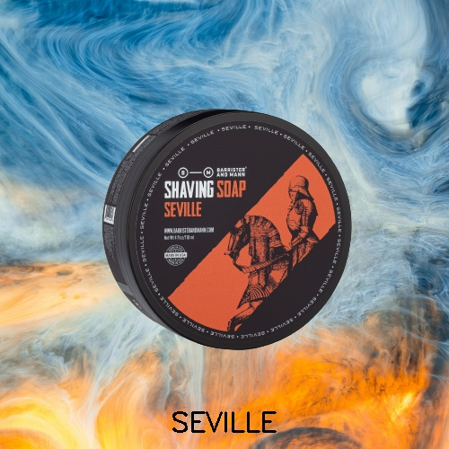

# Advertisement Poster Generator

This is a tool for generating advertisement posters with different backgrounds for product images. The tool allows users to upload a product image, enter a brand name, and provide a background image prompt or text prompt to generate background images from Unsplash.

## Features

- Upload product images
- Enter brand name
- Provide background image prompt or text prompt
- Generate advertisement posters with different backgrounds

## Installation

To run this tool locally, follow these steps:

1. Clone this repository to your local machine:
```git clone https://github.com/yourusername/advertisement-poster-generator.git```

2. Navigate to the project directory:
```cd advertisement-poster-generator```

3. Install the required dependencies:
```pip install -r requirements.txt```

## Usage

To run the tool, execute the following command:
```streamlit run app.py```

Follow the instructions provided on the Streamlit web interface to upload product images, enter brand names, and generate advertisement posters.

## Input Images

The `input_images` folder contains a collection of product images.

## Background Images

The `background_images` folder contains a collection of background images downloaded from Unsplash based on the provided prompts.

## Output Images

The `output_images` folder contains the generated advertisement posters. Each subfolder corresponds to a product image and contains five posters with different backgrounds.
Used the following prompts:
```dark background absract
dark bokkeh
bright abstract 
white background 
white abstract
````

## Sample Output




## Author

Bilal - https://github.com/mhmd-bilal
